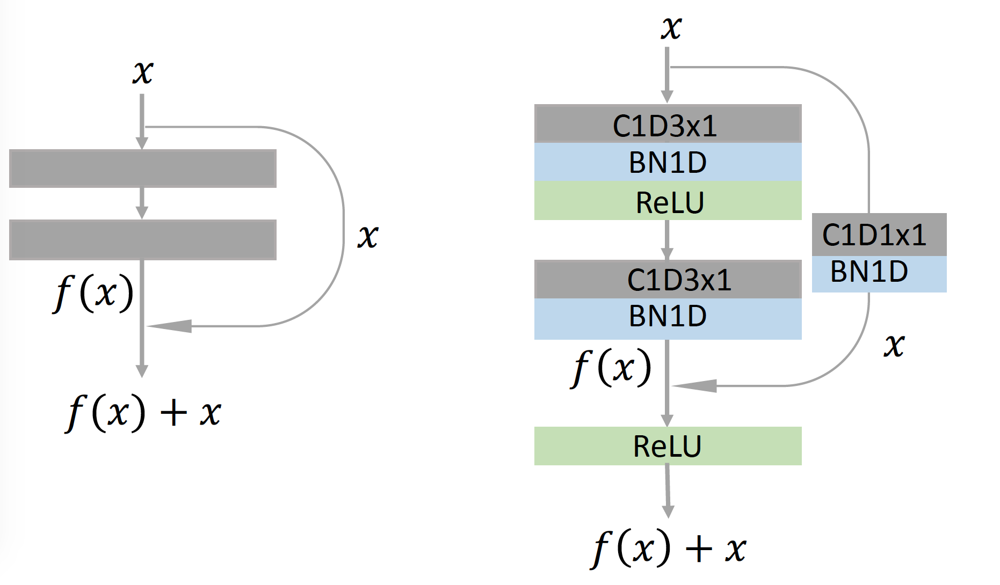
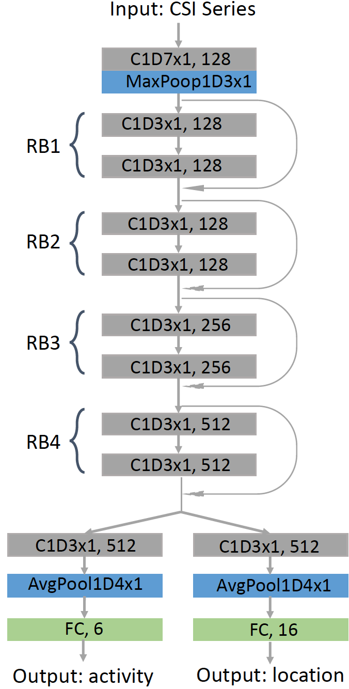

# Action Recognition and Indoor Localization

Code and Data of the paper, [Joint Activity Recognition and Indoor Localization with WiFi Fingerprints](https://arxiv.org/abs/1904.04964).
 

 

# Evaluated Environment 
1. PyTorch 1.0.0


# Usage

1. Please download [data](https://drive.google.com/open?id=1SCxUHbl6rNWM3kT0c-D4s_kyAero9_-o
), and decompress it at the root folder of this repository.

> Activity Label: 0. hand up;  1. hand down; 2. hand left; 3. hand right; 4. hand circle; 5. hand cross.
> Location Label: 0, 1, 2, ..., 15


2. Please download [pre-trained weights](https://drive.google.com/open?id=1UT61Gs746yijxiKvLyP0wHIPxi9MYz0Y), and decompress it at the root folder of this repository.

3. Then run train.py or test.py

You may need original data (not segmented and upsampled) for your research, [here](https://drive.google.com/open?id=1f2SrtotfBlWBrQIRRH-aM56cmJ2Tq9Iw)


# Hardware: Ettus N210 and Ettus Clock


# 1D CNN

1. 1D residual block


2. 1D ResNet-[1,1,1,1]



# For [t-SNE](https://lvdmaaten.github.io/tsne/) visualization

Please download [vis](https://drive.google.com/open?id=1Vd3Bs8V95XzwsJd5Y4cRVN6bimYt5Do4
), and run **main_plot_tsne.m**

1. t-SNE visualization for activity recognition 


2. t-SNE visualization for indoor localization 


If this helps your research, please cite this paper.

```
@article{wang2019joint,
  title={Joint Activity Recognition and Indoor Localization With WiFi Fingerprints},
  author={Wang, Fei and Feng, Jianwei and Zhao, Yinliang and Zhang, Xiaobin and Zhang, Shiyuan and Han, Jinsong},
  journal={IEEE Access},
  volume={7},
  pages={80058--80068},
  year={2019},
}

```
